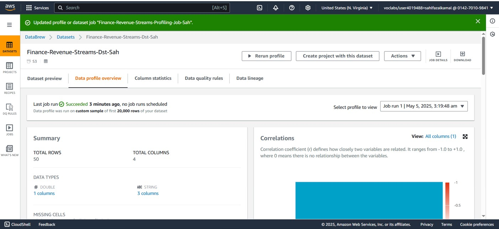

# AWS Project 2 – Data Cleaning with AWS Glue DataBrew and S3

This project focuses on cleaning and organizing financial datasets using AWS Glue DataBrew and storing the outputs in a well-structured Amazon S3 bucket. It also involved reviewing AWS billing usage to manage cloud costs more effectively. The cleaned data is now ready for analysis and reporting.

## Project Description

The goal of this project was to clean raw financial datasets using AWS Glue DataBrew and store them in a clean and accessible format on Amazon S3. The work also included monitoring AWS billing to ensure the infrastructure remained cost-efficient.

## Objective

To prepare financial datasets for analysis by:
- Reviewing and understanding cloud service billing
- Cleaning data using Glue DataBrew recipes
- Organizing cleaned datasets in a structured S3 storage layout

## Dataset

The project focused on three key datasets:
- Historical Budgets
- Department Expenses
- Revenue Streams

Each dataset had formatting issues, null values, and inconsistencies that were addressed using AWS Glue DataBrew.

## Methodology

### 1. AWS Billing Review
Started by checking the AWS Billing Dashboard to review service usage and costs from the previous week. This helped understand how resources were being consumed and how to manage them more efficiently going forward.

**Billing Screenshot**  

### 2. S3 Bucket Setup
Created a new S3 bucket named `finance-cln-sahl`. Two main folders were added:
- `system/` – for internal datasets used by backend systems
- `user/` – for datasets used by end users or teams

This folder structure helped organize the outputs from each dataset type.

**S3 Folder Structure**  
- Historical Budget:   
- Department Expenses:   
- Revenue Streams: 

### 3. Glue DataBrew Projects
Set up separate DataBrew projects for each dataset:
- Historical Budgets
- Department Expenses
- Revenue Streams

Each project allowed for visual data exploration and cleaning without writing code. Common tasks included:
- Removing null values
- Fixing column formats
- Applying consistent field naming

**DataBrew Interface Screenshots**  
- Historical Budget:   
- Department Expenses:   
- Revenue Streams: 

### 4. Running Data Cleaning Jobs
After finalizing the cleaning steps (called "recipes" in Glue DataBrew), I ran the jobs. The cleaned outputs were automatically saved into the correct folders in the S3 bucket:
- system/historical_budgets/
- system/department_expenses/
- system/revenue_streams/
- user/historical_budgets/
- user/department_expenses/
- user/revenue_streams/

**Job Output Confirmation**  

## Tools and Technologies

- AWS Glue DataBrew – for no-code data cleaning
- Amazon S3 – for organizing and storing cleaned datasets
- AWS Billing Dashboard – for monitoring and managing costs

## Key Learnings

- Learned how to use AWS Glue DataBrew for practical data transformation
- Improved ability to plan and structure cloud storage
- Gained insights into AWS cost monitoring and budgeting
- Built a simple end-to-end cleaning pipeline ready for integration into analytics workflows

## Summary

This project shows how cloud-native tools like AWS Glue DataBrew and S3 can be used together to clean and manage financial data. It also highlights the importance of organizing datasets and keeping track of AWS usage to avoid unnecessary costs. The result is a structured, clean, and cost-managed dataset environment that’s ready for reporting and future analysis.
